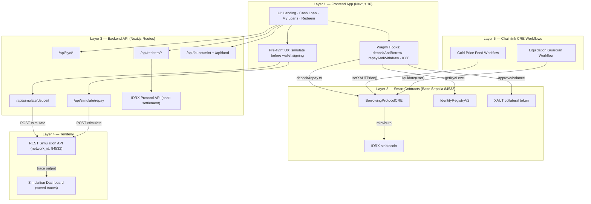
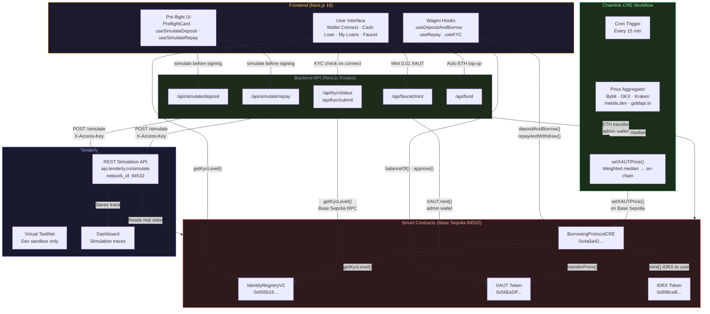
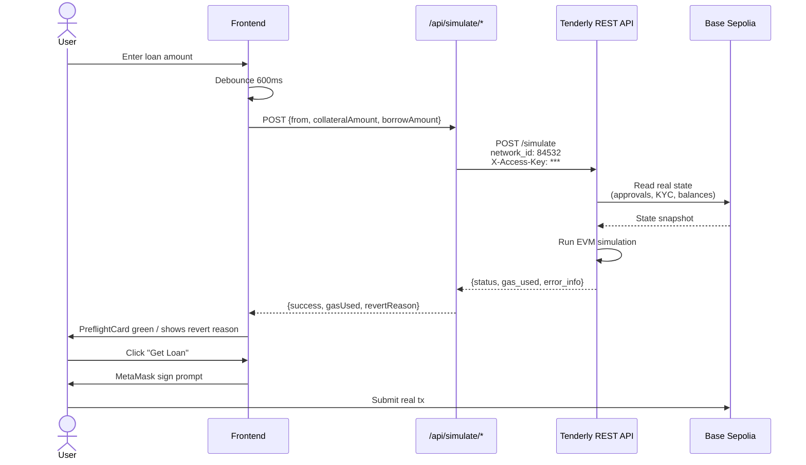
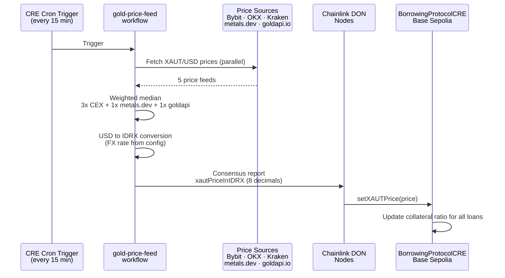
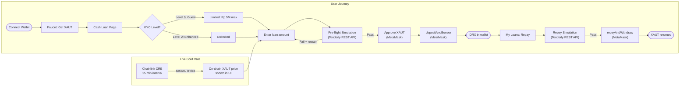
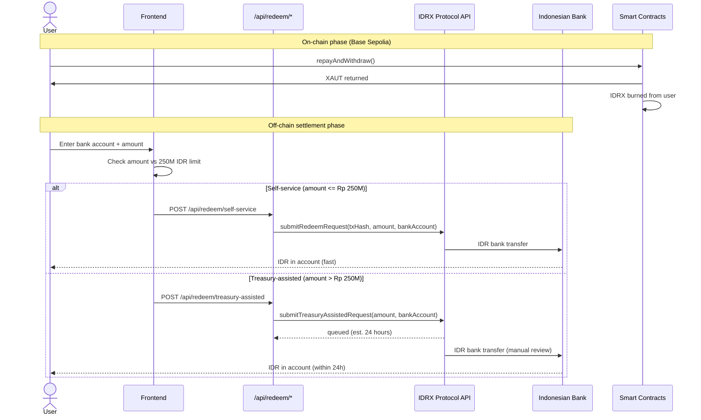

# 🏆 AuRoom Protocol - Frontend

<div align="center">


**From Rupiah to Yield-Bearing Gold**

[](https://nextjs.org/)
[](https://www.typescriptlang.org/)
[](https://wagmi.sh/)
[](https://tailwindcss.com/)
[](./LICENSE)

[🌐 Live Demo](https://auroom-base-testnet.vercel.app) • [📜 Smart Contracts](https://github.com/AuroomProtocol/auroom-base-sc) • [🔧 Backend](https://github.com/AuroomProtocol/auroom-base-be) • [📖 Documentation](#-documentation)

</div>

---

## 🌐 Live Demo

**🔗 [https://auroom-base-testnet.vercel.app](https://auroom-base-testnet.vercel.app)**

> ⚠️ **Testnet Only**: This demo runs on Base Sepolia testnet. Do not use real funds.

---

## 📖 Overview

**AuRoom** is a Real World Asset (RWA) protocol on Base that enables users to access Indonesian Rupiah (IDRX) liquidity using tokenized gold (XAUT) as collateral, and seamlessly redeem IDRX back to fiat currency through bank transfers.

### Why AuRoom?

```
┌────────────────────────────────────────────────────────────────┐
│                                                                 │
│   REGULAR DEX:                                                  │
│   XAUT ──→ IDRX ──→ 🚀 Sell for cash (off-chain, complex)          │
│                                                                 │
│   AUROOM:                                                        │
│   XAUT ──→ Cash Loan ──→ IDRX ──→ 🏦 Direct bank transfer      │
│                                                                 │
│   "Unlock liquidity from your gold. Instant. On-chain."         │
│                                                                 │
└────────────────────────────────────────────────────────────────┘
```

---

## ✨ Features

### 🏠 Landing Page
- Protocol overview and value proposition
- Live protocol statistics (collateral, loans, prices)
- Educational content about RWA and tokenized gold
- Comparison: AuRoom vs Traditional DEX

### 💰 Cash Loan Page
- Borrow IDRX using XAUT collateral
- Flexible LTV options (30%, 40%, 50%)
- Instant liquidity without selling your gold
- Integrated bank details for redeem

### 📊 My Loans Page
- Track active loans and collateral
- View loan health and liquidation risk
- Repay loans to unlock collateral
- Transaction history

### 💎 IDRX Redeem Flow
- Burn IDRX tokens on-chain
- Direct bank transfer to Indonesian bank accounts
- Support for major banks (BCA, BNI, BRI, Mandiri)
- Real-time status tracking with reference number

### 💱 Swap Page
- Swap IDRX ↔ XAUT ↔ USDC seamlessly
- Real-time quotes from on-chain data
- Slippage protection
- Transaction status tracking

### 🛠️ Admin Page
- **Faucet**: Get test tokens (IDRX, USDC, XAUT)
- **Liquidity**: Add/remove liquidity to pools
- **Identity**: Manage user verification
- **Debug**: View balances, allowances, contract info

---
## Architecture (5 Layers)

AuRoom is organized into 5 production layers used in the demo flow:

1. Frontend App (Next.js)
2. Smart Contracts (Base Sepolia)
3. Backend API (Next.js routes)
4. Tenderly (pre-flight simulation + traces)
5. Chainlink CRE Workflows (price feed + liquidation guardian)



### Detailed Architecture Diagrams

#### 1. Component Relationship Map



#### 2. Tenderly Integration Detail



#### 3. Chainlink CRE Workflow Integration



#### 4. Full Transaction Lifecycle



#### 5. Off-chain Settlement Flow



---

## ️ Tech Stack

### Core
| Technology | Version | Purpose |
|------------|---------|---------|
| Next.js | 16.1.0 | React framework with App Router |
| React | 19.2.3 | UI library |
| TypeScript | 5.x | Type safety |

### Web3
| Technology | Version | Purpose |
|------------|---------|---------|
| wagmi | 2.19.5 | React hooks for Ethereum |
| viem | 2.x | Ethereum interactions |
| RainbowKit | 2.x | Wallet connection UI |
| @tanstack/react-query | 5.x | Data fetching & caching |

### UI/UX
| Technology | Version | Purpose |
|------------|---------|---------|
| Tailwind CSS | 4.x | Utility-first styling |
| Radix UI | Various | Accessible components |
| Lucide React | 0.562.0 | Icons |
| GSAP | 3.14.2 | Animations |
| Three.js | 0.182.0 | 3D graphics |
| Recharts | 2.15.4 | Charts |
| Sonner | 2.0.7 | Toast notifications |

---

## 📁 Project Structure

```
auroom-base-fe/
├── app/                      # Next.js App Router
│   ├── page.tsx              # Landing page
│   ├── layout.tsx            # Root layout
│   ├── globals.css           # Global styles
│   ├── swap/page.tsx         # Swap page
│   ├── cash-loan/page.tsx    # Cash Loan page
│   ├── my-loans/page.tsx     # My Loans page
│   ├── verify/page.tsx       # Verification page
│   └── admin/page.tsx        # Admin helper page
├── components/
│   ├── ui/                   # Reusable UI components
│   ├── layout/               # Layout components
│   ├── landing/              # Landing page sections
│   ├── cash-loan/            # Cash Loan components
│   └── features/admin/       # Admin page components
├── hooks/                    # Custom React hooks
│   ├── useLoan.ts
│   ├── contracts/            # Contract interaction hooks
│   └── admin/                # Admin-specific hooks
├── lib/
│   ├── contracts/            # Contract addresses & ABIs
│   │   ├── base_addresses.ts # Base Sepolia addresses
│   │   ├── chains.ts         # Chain configuration
│   │   └── abis/             # Contract ABIs
│   ├── wagmi.ts              # Wagmi configuration
│   └── utils/                # Utility functions
├── providers/                # React context providers
└── public/                   # Static assets
```

---

## 🚀 Getting Started

### Prerequisites

- Node.js 20.x or later
- pnpm (recommended) / npm / yarn

### Installation

```bash
# Clone the repository
git clone https://github.com/AuroomProtocol/auroom-base-fe.git
cd auroom-base-fe

# Install dependencies
pnpm install

# Run development server
pnpm dev
```

Open [http://localhost:3000](http://localhost:3000) in your browser.

### Environment Variables

Create a `.env` file:

```env
# WalletConnect Project ID (get from https://cloud.walletconnect.com)
NEXT_PUBLIC_WALLETCONNECT_PROJECT_ID=your_project_id

# Contract Addresses (Base Sepolia)
MOCK_IDRX=0x998ceb700e57f535873D189a6b1B7E2aA8C594EB
MOCK_USDC=0xCd88C2886A1958BA36238A070e71B51CF930b44d
XAUT=0x56EeDF50c3C4B47Ca9762298B22Cb86468f834FC
IDENTITY_REGISTRY=0xA8F2b8180caFC670f4a24114FDB9c50361038857
UNISWAP_FACTORY=0xDb198BEaccC55934062Be9AAEdce332c40A1f1Ed
UNISWAP_ROUTER=0x620870d419F6aFca8AFed5B516619aa50900cadc
PAIR_IDRX_USDC=0xd1fED56a7B4C93DF968494Bb9a6023546Da45D3B
PAIR_XAUT_USDC=0x61E24e8A69553D55bae612f2dF4d959654181652
SWAP_ROUTER=0x41c7215F0538200013F428732900bC581015c50e
BORROWING_PROTOCOL_V2=0x3A1229F6D51940DBa65710F9F6ab0296FD56718B

# IDRX API Configuration
IDRX_API_BASE_URL=https://api.idrx.org
IDRX_API_KEY=your_api_key_here
IDRX_MODE=demo  # Use 'demo' for testing, 'production' for real API
```

---

## 📜 Contract Addresses

All contracts are deployed on **Base Sepolia Testnet** (Chain ID: 84532)

| Contract | Address |
|----------|---------|
| **Tokens** | |
| IDRX | `0x998ceb700e57f535873D189a6b1B7E2aA8C594EB` |
| USDC | `0xCd88C2886A1958BA36238A070e71B51CF930b44d` |
| XAUT (Gold) | `0x56EeDF50c3C4B47Ca9762298B22Cb86468f834FC` |
| **Infrastructure** | |
| IdentityRegistry | `0xA8F2b8180caFC670f4a24114FDB9c50361038857` |
| UniswapV2Factory | `0xDb198BEaccC55934062Be9AAEdce332c40A1f1Ed` |
| UniswapV2Router | `0x620870d419F6aFca8AFed5B516619aa50900cadc` |
| **Liquidity Pairs** | |
| IDRX/USDC Pair | `0xd1fED56a7B4C93DF968494Bb9a6023546Da45D3B` |
| XAUT/USDC Pair | `0x61E24e8A69553D55bae612f2dF4d959654181652` |
| **Core Protocol** | |
| SwapRouter | `0x41c7215F0538200013F428732900bC581015c50e` |
| BorrowingProtocolV2 | `0x3A1229F6D51940DBa65710F9F6ab0296FD56718B` |

> 💡 **Block Explorer**: [Base Sepolia Basescan](https://sepolia.basescan.org)

---

## 🎮 How to Use

### 1. Connect Wallet

1. Click "Connect Wallet" button
2. Select your preferred wallet (MetaMask, Coinbase, etc.)
3. Switch to Base Sepolia network if prompted

### 2. Get Test Tokens

1. Go to [Admin Page](/admin)
2. Use the Faucet tab to mint test tokens:
   - IDRX (Indonesian Rupiah)
   - USDC
   - XAUT (Gold - requires verification)

### 3. Get Verified (Demo KYC)

1. Visit [Demo KYC Page](/demo-kyc)
2. Enter your wallet address
3. Submit for verification
4. Admin will approve (or self-approve in admin page)

### 4. Get a Cash Loan

1. Go to [Cash Loan Page](/cash-loan)
2. Enter desired loan amount in IDRX
3. Select LTV (30%, 40%, or 50%)
4. Review collateral required (in XAUT)
5. Approve XAUT if needed
6. Click "Borrow" and confirm transaction
7. Receive IDRX tokens instantly!

### 5. Enter Bank Details for Redeem

1. After borrowing, enter your Indonesian bank details:
   - Select bank (BCA, BNI, BRI, Mandiri)
   - Enter 10-12 digit account number
   - Enter account holder name
2. Click "Submit & Redeem"

### 6. Track Your Loans

1. Go to [My Loans Page](/my-loans)
2. View all active loans
3. Monitor collateral and health factor
4. Repay loans to unlock your XAUT collateral

### 7. Swap Tokens (Optional)

1. Go to [Swap Page](/swap)
2. Select tokens to swap (IDRX, USDC, XAUT)
3. Enter amount
4. Review quote and slippage
5. Click "Swap" and confirm

---

## 🧪 Development

### Scripts

```bash
# Development server
pnpm dev

# Production build
pnpm build

# Start production server
pnpm start

# Lint code
pnpm lint
```

---

## 🚢 Deployment

### Vercel (Recommended)

1. Push code to GitHub
2. Import project in [Vercel](https://vercel.com)
3. Add environment variables
4. Deploy!

---

## 🔐 Security Notes

- ⚠️ **Testnet Only**: This is a demo on Base Sepolia
- ⚠️ **No Real Funds**: All tokens are mock/test tokens
- ⚠️ **KYC Required**: Users must be verified to use XAUT
- ⚠️ **Demo Mode**: IDRX redeem uses mock API by default
- ✅ **Non-Custodial**: You always control your keys
- ✅ **On-Chain Verification**: All burns are recorded on blockchain
- ✅ **Slippage Protection**: Built into all swaps

---

## 🗺️ Roadmap

- [x] Landing page with protocol info
- [x] Swap functionality (IDRX ↔ XAUT ↔ USDC)
- [x] Cash Loan with collateral (BorrowingProtocolV2)
- [x] IDRX Redeem to bank accounts
- [x] My Loans tracking page
- [x] Admin helper tools
- [x] Demo mode for testing
- [x] Live protocol statistics
- [x] Base Sepolia deployment
- [ ] Real IDRX API integration (production mode)
- [ ] Transaction history improvements
- [ ] Mobile app (React Native)
- [ ] Mainnet deployment on Base

---

## 🤝 Contributing

Contributions are welcome!

1. Fork the repository
2. Create your feature branch (`git checkout -b feature/AmazingFeature`)
3. Commit your changes (`git commit -m 'Add some AmazingFeature'`)
4. Push to the branch (`git push origin feature/AmazingFeature`)
5. Open a Pull Request

---

## 📄 License

This project is licensed under the MIT License - see the [LICENSE](LICENSE) file for details.

---

## 🙏 Acknowledgments

- **Base** - L2 Blockchain Infrastructure by Coinbase
- **IDRX.org** - Indonesian Rupiah stablecoin provider
- **RainbowKit** - Beautiful wallet connection
- **wagmi** - Excellent React hooks for Ethereum
- **Vercel** - Hosting platform
- **shadcn/ui** - UI component inspiration

---

<div align="center">

**Built with ❤️ on Base Sepolia**

[⬆ Back to Top](#-auroom-protocol---frontend)

</div>
